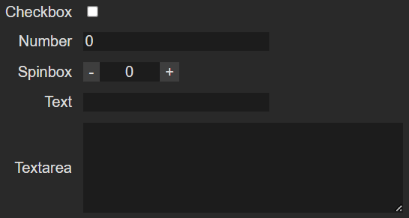
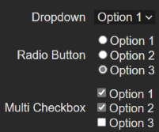
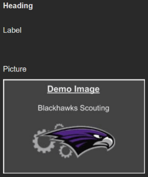
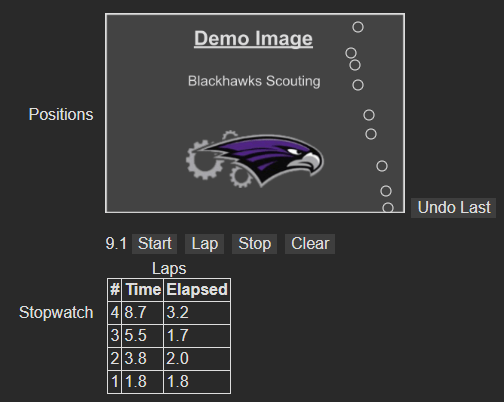

# Widgets

## Overview

Black Hawks Scouting provides numerous widgets as well as a [layout system](grid.md), allowing you to create flexible and intuitive user interfaces for your scouting forms.

A widget's type, size, and position are specified in its [JSON object](config.md#widget-objects).

The type of a widget determines how its data is exported in the CSV file. In addition, certain widget types are for display only and do not export any values.

## Basic Widgets

These are widgets that take a single value.



### Checkbox

A checkbox input. Can be one of two values - checked or unchecked.

**Type String:** `checkbox`

**Exports:** `false` if unchecked, `true` if checked.

### Number

A numeric input. Displays similar to Text, but only allows numbers.

**Type String:** `number`

**Exports:** The value entered.

### Spinbox

A numeric input, similar to Number. Includes increment and decrement buttons to act as a counter in some cases.

**Type String:** `spinbox`

**Exports:** The value entered.

### Text

A textbox input. Any value may be entered.

**Type String:** `text`

**Exports:** The text entered.

### Textarea

A large textbox input. Multiple lines are allowed, can be resized.

**Type String:** `textarea`

**Exports:** The text entered.

## Multi-Select Widgets

These are widgets that present a set of selections to the user.



### Dropdown, Radio Button

A dropdown or radio button widget. The user may only select one option in the list.

**Type String:** `dropdown`, `radio`

**Exports:** The index of the selected option in the `options` array. This index starts at `0`.

**Note:** Generally, for optimal UX, if you have few options (less than 5) or if comparing between options is important, use a radio button; otherwise, use a dropdown.

### Multi Checkbox

A group of checkboxes. Similar to Radio Button, except the user may select multiple or no options.

**Type String:** `multicheckbox`

**Exports:** The index of each selected option in the `options` array. If there are multiple, they are delimited by spaces. (If the user doesn't select any options, the exported value is empty.)

## Display Widgets

These are widgets that are only used for display purposes. They do not export data.



### Heading, Label

Text widgets. Label displays the same as a standard widget label, while Heading displays larger. The text in the widget's `name` field will be what is displayed.

**Type String:** `heading`, `label`

### Picture

An image. The size can be specified with the [`width` and `height` fields](config.md#picture-positions).

**Type String:** `picture`

### Spacer

A widget to act as a separator. Takes up a grid cell, but is invisible.

**Type String:** `spacer`

## Misc. Widgets

These are widgets that do not fall into any of the other categories.



### Positions

A location selector widget. The user can select points on an image (the circles displayed in the widget above) to export.

**Type String:** `positions`

**Exports:** The coordinates of each selected point in the format `x,y`. If there are multiple coordinates, they are separated with spaces (i.e. `x1,y1 x2,y2 x3,y3`).

Each x/y value is a decimal from 0 to 1, with 0 being the left/top of the image and 1 being the right/bottom. This is so coordinate values are independent from the image dimensions.

To parse the exported string into coordinate pairs, first split the string by spaces. Then, iterate over each resultant string and split them by commas. Finally, convert each split string to a floating-point value.

An example with Python is as follows:

```python
data_string = "0.725,0.669 0.224,0.769 0.990,0.362"

points = [[float(j) for j in i.split(",")] for i in data_string.split(" ")]

# => [[0.725, 0.669], [0.224, 0.769], [0.99, 0.362]]
```

### Stopwatch

A stopwatch widget. Can be used to record elapsed time and laps.

**Type String:** `stopwatch`

**Exports:** Each lap duration delimited by spaces, followed by the total elapsed time at the end. (If no laps were recorded, only the elapsed time is present.)

### Team Selection Page

Allows selection of a match and team. If `skipTeamSelection` is `false`, this page appears as the first page on the scouting form.

**Exports:** This page exports four values:

- `EventKey`: The Blue Alliance event key entered.
- `MatchLevel`: The match level:
  - Qualifications: `0`
  - Quarterfinals: `1`
  - Semifinals: `2`
  - Finals: `3`
- `MatchNumber`: The match number.
- `Team`: The team information in the following order, delimited by commas:
  - Alliance color (`Red` or `Blue`)
  - Index within alliance (`1` to `3`)
  - Team number
  - Team name
